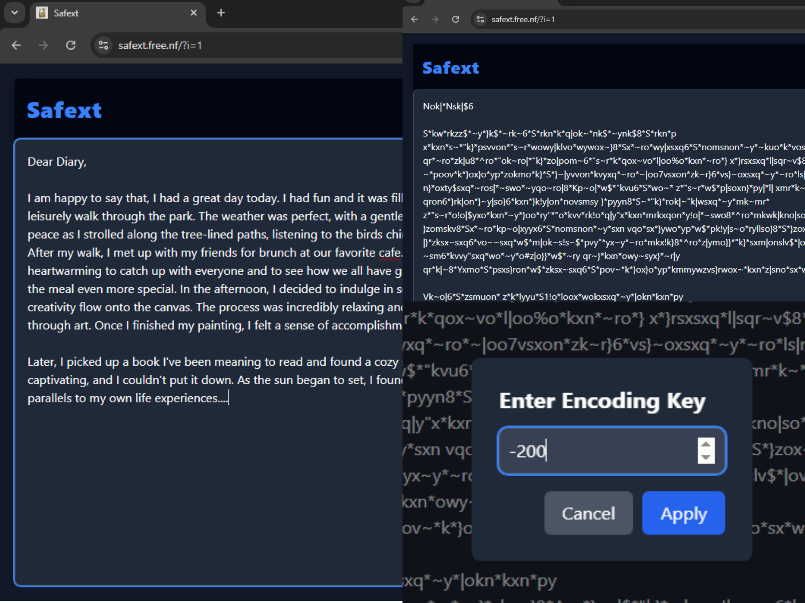

# 🛡️ Safext

## 🔍 Overview  
**Safext** is a simple yet effective solution to prevent unauthorized peeking at your screen while writing or texting. It encrypts your text using a basic **Shift Cipher**, making it unreadable for shoulder-surfers while still allowing you to type naturally. Note that this is a prototype.



## 🚀 Features  
✅ **Reduces Text Readability** - Converts readable text into a unreadable format using a shift cipher. This makes text look like gibberish.

✅ **Fast & Lightweight** - Works seamlessly without slowing down your typing.  

✅ **User-Friendly** - Assumes users can type without looking at the keyboard.  

✅ **Future Enhancements Planned** - Backend service, password protection, and stronger encryption methods.  

## 🔧 Installation  
```sh
# Clone the repository
git clone https://github.com/WuiiiGithub/safext.git
cd safext

# Open the project
# Run index.html in a browser or integrate with your system
```

## 🛠️ Usage  
1. Start typing normally in the provided text area.  
2. You will be asked the key and you have to enter it. Let's say k=2
3. The text will be converted to an unreadable format in real-time.  
4. It uses the key to make text unreadable.
5. Then you have to use negetive of the key. In our example, k=-2 to see orginal text.
6. Don't write text here now. If you want to write then encrypt it with the same key (k=2) then start writing.
7. You can download and upload the text. If you want to make the text back to orginal form if text is uploaded in encrypted form, then use the key to decrypt after uploading.

## 📌 Future Plans  
🔹 Implement backend services for stronger encryption.  
🔹 Add password-based access for decrypting messages.  
🔹 Introduce more advanced encryption algorithms beyond Shift Cipher.

---

Made with ❤️ to keep your privacy safe!  
